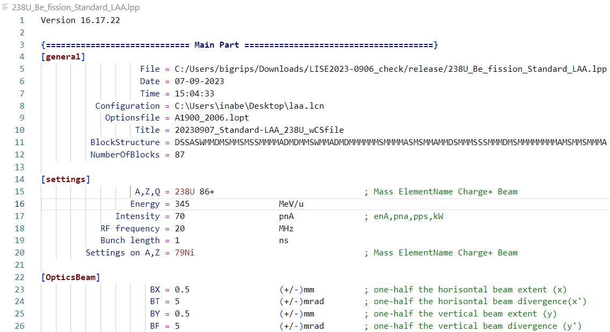

# lise-reader README

You can use the [LISE++](https://lise.nscl.msu.edu/lise.html) file syntax highlighter in VS Code.



## Features

It supports the basic syntax of LISE++ file.

## Requirements

VSCode, node, and git

## Extension Settings

### For Windows

```
cd %USERPROFILE%\.vscode\extensions
git clone https://github.com/yoshimotomasahir/LISE-Reader
```
Restart vscode.

### For Mac and Linux

```
cd ~/.vscode/extensions
git clone https://github.com/yoshimotomasahir/LISE-Reader
```
Restart vscode.

## Known Issues

Nothing

## Release Notes

### 0.0.1

First version.
